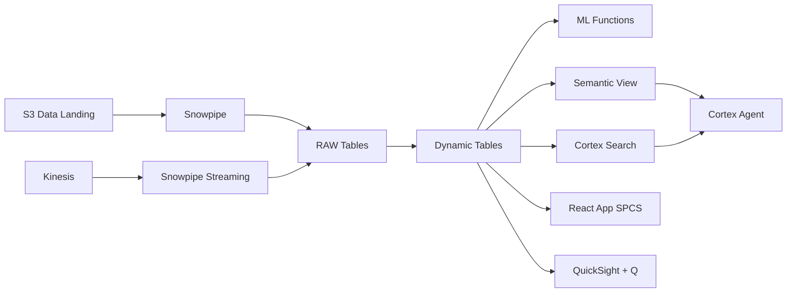

# Sukuk Portfolio Analytics

Real-time Sukuk portfolio management for Malaysia's world-leading Islamic capital market — Dynamic Tables build portfolio views, Iceberg enables cross-institution analysis, and Cortex Analyst answers portfolio questions.

## Architecture

Malaysia dominates the global Sukuk market with 51% market share. A leading Islamic fund manages RM 2.3 billion across 500 holdings in 4 Shariah-compliant structures. With yields projected to compress and 3 counterparties on the watchlist, the CIO needs real-time portfolio intelligence — but siloed systems across custodians mean the full risk picture takes days to assemble manually.



## Snowflake Capabilities

| Capability | Implementation |
|-----------|---------------|
| Dynamic Tables | PORTFOLIO_SUMMARY / YIELD_CURVES / COUNTERPARTY_RISK / MATURITY_LADDER |
| ML Functions | ML.FORECAST |
| Cortex AI | COMPLETE, AI_EXTRACT, SUMMARIZE |
| Cortex Search | 40 documents indexed |
| Cortex Agent | SUKUK_PORTFOLIO_AGENT |
| Semantic View | SUKUK_PORTFOLIO_ANALYTICS |
| React App (SPCS) | 5 tabs + DemoGuide |


## AWS Services

| Service | Role in Demo |
|---------|-------------|
| Amazon Kinesis | Stream real-time market data and pricing feeds |
| Apache Iceberg (S3) | Open table format for cross-institution portfolio sharing |
| AWS Glue | ETL for market data transformation and enrichment |
| Amazon Athena | Ad-hoc query on Iceberg tables for cross-institution analysis |
| Amazon QuickSight + Q | Portfolio dashboard with natural language analytics |


## Personas

| Persona | Role | Key Questions |
|---------|------|---------------|
| **Tan Sri Ahmad Zulkifli** | CIO Islamic Fund | "What is our portfolio's weighted average yield?" "Which issuers are on the watchlist?" |
| **Amir bin Razak** | Portfolio Manager | "Show me the maturity ladder for next 12 months." "What's the mark-to-market on our Ijara Sukuk holdings?" |


## Data

| Table | Rows | Description |
|-------|------|-------------|
| SUKUK_HOLDINGS | 500 | Sukuk portfolio holdings across 4 structures (Ijara, Murabahah, Wakala, Musharakah) |
| VALUATIONS | 10,000 | Daily mark-to-market valuations for all holdings |
| COUNTERPARTIES | 200 | Issuer and counterparty profiles with credit ratings |
| MARKET_DATA | 50,000 | Islamic interbank rates, benchmark yields, and market indicators |
| PORTFOLIO_DOCS | 40 | Investment committee papers, term sheets, and prospectuses |


## Build Instructions

### Prerequisites
- Snowflake account with ACCOUNTADMIN access
- Cortex AI enabled (ML Functions, Search, Agent)
- Warehouse: SUKUK_WH (Medium)
- AWS CLI with access (us-west-2)

### Deployment

```bash
snowsql -f snowflake/00_setup.sql
snowsql -f snowflake/01_marketplace_install.sql
snowsql -f snowflake/02_raw_tables.sql
snowsql -f snowflake/03_staging.sql
snowsql -f snowflake/04_dynamic_tables.sql
snowsql -f snowflake/05_search.sql
snowsql -f snowflake/06_ml_models.sql
snowsql -f snowflake/07_semantic_view.sql
snowsql -f snowflake/08_agent.sql
```

### React App (SPCS)
```bash
cd app && npm ci && npm run build
docker build -t aws-malaysia-islamic-finance-sukuk-app .
docker push bdiqc8sm-default.registry.snowflakecomputing.com/islamic_sukuk_portfolio/app/aws_malaysia_islamic_finance_sukuk/app:latest
```

### Demo Mode
Open the app URL with `?demo=true` for presenter view.

## Build Modes

### Snowflake Only
Run scripts 00-08 (skip AWS-specific integration). Uses:
- **Snowpipe Streaming SDK** instead of Amazon Kinesis
- **Snowflake Managed Iceberg Tables** instead of Apache Iceberg (S3)
- **Dynamic Tables** instead of AWS Glue
- **Snowflake SQL on Iceberg** instead of Amazon Athena
- **Snowflake Intelligence (Cortex Analyst)** instead of Amazon QuickSight + Q

### Full AWS + Snowflake
Run all scripts including AWS integration. Deploy QuickSight dashboard from `quicksight/`.

## Business Impact

Industry research and Snowflake customer outcomes:
- **Malaysia held 51% of global Sukuk outstanding (US$539B) in 2023** — [Securities Commission Malaysia](https://www.sc.com.my/development/islamic-capital-market)
- **Malaysia's Islamic fund management industry grew 12.8% YoY to RM 250B AUM** — [MIFC](https://www.mifc.com/)
- **Real-time portfolio analytics reduces risk reporting latency from days to minutes** — [McKinsey Asset Management](https://www.mckinsey.com/industries/financial-services/our-insights)
- **Open data formats (Iceberg) reduce cross-institution data sharing costs by 60-80%** — [Snowflake](https://www.snowflake.com/en/data-cloud/apache-iceberg/)


## Key Demo Numbers

- **RM 2.3B** Sukuk portfolio AUM across 4 structures
- **500 holdings** across Ijara, Murabahah, Wakala, and Musharakah
- **12.3%** weighted average yield (180bps above benchmark)
- **3 issuers** on watchlist following credit rating review
- **50,000 data points** market data refreshed every 2 hours


## License

Apache 2.0 — See [LICENSE](LICENSE) for details.

This is a personal demo project and is not an official Snowflake offering. It comes with no support or warranty.