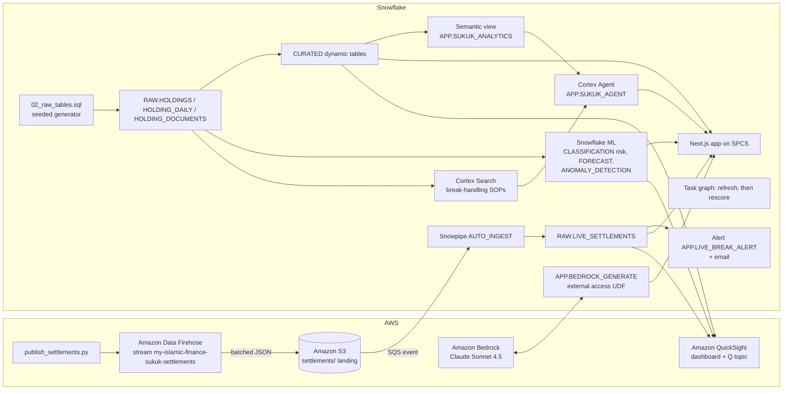

# Malaysia Sukuk Portfolio Operations - Settlement Breaks and Escalation

End-to-end back-office operations for **40 sukuk holdings in a fictional Malaysian investor's portfolio, serviced by 5 fictional custodians**, using Snowflake, optionally with AWS: from a live settlement break to a 7-day escalation risk score, an alert email and an AI action memo for the operations team.

## Architecture

A settlement operations pipeline built on **Snowflake** (Dynamic Tables, Snowflake ML, Cortex Search, Cortex Agent, Cortex AI_COMPLETE, SPCS) and, in the full build, **AWS** (Amazon Data Firehose, S3, Bedrock Claude, QuickSight + Amazon Q). Settlement events land in `RAW.LIVE_SETTLEMENTS`. Dynamic tables curate 90 days of holding-day history: settlement and distribution instructions processed, settlement breaks, escalations to custodian investigation, resolution SLA breaches, settlement match rate and position reconciliation compliance. Snowflake ML scores 7-day break escalation risk per holding, forecasts portfolio-wide break volume and flags auto-match failure rate anomalies. A Cortex Agent answers questions with SOP citations, and an LLM drafts the operations action memo.

The holdings cover five sukuk types: sovereign murabahah series (murabahah is a cost-plus sale structure), sovereign wakalah series and a retail sukuk wakalah series (wakalah is an agency-based structure), corporate ijarah (ijarah is a lease-based structure), and corporate musharakah (a profit-sharing structure, so periodic distributions depend on reported results). The demo models settlement and distribution operations only. It does not make Shariah or regulatory rulings, give investment advice or predict prices, and its SOPs are synthetic.

Interactive diagrams (hover for object names): [Snowflake only](docs/architecture-snowflake.html) | [AWS + Snowflake](docs/architecture-aws.html). The app shows both on its Architecture & Data tab, the current build first. Regenerate them with `python3 docs/build_architecture.py`.


```mermaid
flowchart LR
    subgraph AWS
      SIM[publish_settlements.py] --> FH[Amazon Data Firehose<br/>stream my-islamic-finance-sukuk-settlements]
      FH -->|batched JSON| S3[(Amazon S3<br/>settlements/ landing)]
      BR[Amazon Bedrock<br/>Claude Sonnet 4.5]
      QS[Amazon QuickSight<br/>dashboard + Q topic]
    end
    subgraph Snowflake
      S3 -->|SQS event| PIPE[Snowpipe AUTO_INGEST] --> LIVE[RAW.LIVE_SETTLEMENTS]
      GEN[02_raw_tables.sql<br/>seeded generator] --> RAW[RAW.HOLDINGS / HOLDING_DAILY / HOLDING_DOCUMENTS]
      RAW --> DT[CURATED dynamic tables]
      RAW --> ML[Snowflake ML<br/>CLASSIFICATION risk, FORECAST,<br/>ANOMALY_DETECTION]
      DT --> SV[Semantic view<br/>APP.SUKUK_ANALYTICS]
      RAW --> CS[Cortex Search<br/>break-handling SOPs]
      SV --> AG[Cortex Agent<br/>APP.SUKUK_AGENT]
      CS --> AG
      LIVE --> AL[Alert APP.LIVE_BREAK_ALERT<br/>+ email]
      UDF[APP.BEDROCK_GENERATE<br/>external access UDF]
      TK[Task graph: refresh, then rescore]
      APP[Next.js app on SPCS]
    end
    BR <--> UDF
    DT --> APP
    ML --> APP
    LIVE --> APP
    AG --> APP
    UDF --> APP
    DT --> QS
    ML --> QS
    LIVE --> QS
```

The Snowflake-only build drops the AWS subgraph: `APP.SIMULATE_SETTLEMENTS` writes to `RAW.LIVE_SETTLEMENTS`, and the app calls Cortex `AI_COMPLETE` instead of the Bedrock UDF.

## Snowflake Capabilities

| Capability | Implementation |
|-----------|---------------|
| Dynamic Tables | `CURATED.KPI_SUMMARY`, `PERFORMANCE_SUMMARY`, `BREAK_SUMMARY`, `TREND_ANALYSIS` from the RAW tables |
| Snowflake ML | CLASSIFICATION 7-day break escalation risk (`ML.ESCALATION_RISK_SCORES`), 14-day break-volume FORECAST, auto-match failure rate ANOMALY_DETECTION |
| Cortex Search | 14 synthetic break-handling SOPs (one per sukuk type and break reason) in `SEARCH.BREAK_SOP_SEARCH` |
| Semantic View | `APP.SUKUK_ANALYTICS` over holdings, break reasons, daily totals and risk |
| Cortex Agent | `APP.SUKUK_AGENT`: Cortex Analyst over the semantic view plus Cortex Search for SOP citations |
| Cortex AI | `AI_COMPLETE('claude-sonnet-4-5')` for grounded answers, and for the action memo in the Snowflake-only build |
| Alerts + Tasks | `APP.LIVE_BREAK_ALERT` logs BREAK events and sends email; task graph `TASK_REFRESH_CURATED`, then `TASK_RESCORE_RISK` |
| Snowpark Container Services | Next.js app `APP.MY_ISLAMIC_FINANCE_SUKUK_APP` with 6 tabs: Executive Cockpit, Predictive, Controls, Live Settlements, Ask AI, Architecture & Data |
| Snowpipe | `RAW.LIVE_SETTLEMENTS_PIPE` AUTO_INGEST from S3 (AWS build only) |

## AWS Services

Used only in the AWS + Snowflake build.

| Service | Role in Demo |
|---------|-------------|
| Amazon Data Firehose | Direct PUT stream `my-islamic-finance-sukuk-settlements` receives simulated settlement events and writes batches to S3 |
| Amazon S3 | Landing bucket (`settlements/`). An event notification goes to the Snowpipe SQS queue |
| Amazon Bedrock | Claude Sonnet 4.5 writes the action memo, called from Snowflake through an external-access UDF |
| Amazon QuickSight | DIRECT_QUERY executive dashboard over Snowflake (daily settlement breaks, escalations by holding, escalation risk) |
| Amazon Q | Natural-language questions over the QuickSight topic `my-islamic-finance-sukuk-topic` |
| AWS IAM | Least-privilege roles for S3, Firehose and Bedrock |

## Personas

These personas are fictional.

| Persona | Role | Key Questions |
|---------|------|---------------|
| **Nurul Huda Ismail** | Head of Sukuk Operations | "What is our settlement match rate?" "Which break reasons turn into custodian investigations?" |
| **Daniel Lim** | Settlement Analyst | "Which holdings are high risk this week, and which SOP applies?" |

## Data

All data is synthetic and seeded, so every rebuild reproduces it. The investor, holdings, custodians and names are fictional, and no real issuer or series is modelled.

| Table | Rows | Description |
|-------|------|-------------|
| RAW.HOLDINGS | 40 | Sukuk holdings across 5 fictional custodians (one each in Kuala Lumpur, George Town, Johor Bahru, Kota Kinabalu and Kuching) and 5 sukuk types (Sovereign murabahah, Sovereign wakalah, Retail sukuk wakalah, Corporate ijarah, Corporate musharakah), with a settlement complexity grade |
| RAW.HOLDING_DAILY | 3,600 | Daily holding observations over 90 days: settlement and distribution instructions, value (MYR), settlement breaks, escalations, resolution SLA breaches, break reason, position reconciliations, auto-match failure rate and average break age (hours) |
| RAW.HOLDING_DOCUMENTS | 40 | Required, on-file and pending holding file documents per holding |
| SEARCH.BREAK_DOCS | 14 | Synthetic break-handling SOPs indexed for Cortex Search |
| RAW.LIVE_SETTLEMENTS | Grows during the demo | Live settlement events from Firehose (AWS build) or `APP.SIMULATE_SETTLEMENTS` (Snowflake-only build) |
| ML.ESCALATION_RISK_SCORES | 40 | 7-day escalation probability and risk band per holding |

## Build Instructions

### Prerequisites
- Snowflake account with ACCOUNTADMIN access, and Cortex AI enabled (AI_COMPLETE, Search, Agent).
- An X-Small warehouse with auto-suspend at or below 120 s, and an existing SPCS compute pool.
- Python 3.11+, `snowflake-connector-python`, Node.js 22+, Docker and the `snow` CLI.
- App image: run `snow spcs image-registry login`, then build and push `my-islamic-finance-sukuk-app:v1` to the database's `APP.IMAGES` repository (see the header of `snowflake/07_deploy_app.sql`).
- AWS build only: `boto3`, AWS credentials for the target account (us-west-2) with Bedrock access, and QuickSight Enterprise.

### SPCS App
```
<DATABASE>.APP.MY_ISLAMIC_FINANCE_SUKUK_APP
```

### Tests
```bash
python -m pytest aws snowflake quicksight
```

For a local run, put `SNOWFLAKE_ACCOUNT`, `SNOWFLAKE_USER`, `SNOWFLAKE_DATABASE`, `SNOWFLAKE_WAREHOUSE`, `SNOWFLAKE_AUTHENTICATOR=PROGRAMMATIC_ACCESS_TOKEN`, `SNOWFLAKE_TOKEN` and `DEMO_PLATFORM` in the environment, then run `npm --prefix app run build && npm --prefix app start`.

## Build Modes

Both modes share the same core. They differ in three places, and the app's `DEMO_PLATFORM` setting (in its SPCS spec) switches the memo provider and the Live Settlements tab.

| Layer | Snowflake Only | Full AWS + Snowflake |
|---|---|---|
| Live settlements | `CALL APP.SIMULATE_SETTLEMENTS(n)` inserts simulated settlement events into `RAW.LIVE_SETTLEMENTS`. This simulates a settlement feed; it is not Snowpipe Streaming | `aws/publish_settlements.py` to Amazon Data Firehose, then S3, SQS and Snowpipe AUTO_INGEST |
| Action memo | Cortex `AI_COMPLETE('claude-sonnet-4-5')` | Amazon Bedrock Claude Sonnet 4.5 through `APP.BEDROCK_GENERATE` |
| BI and natural-language questions | The SPCS app is the dashboard; questions go to the Cortex Agent | Also a QuickSight dashboard and an Amazon Q topic |
| App setting | `DEMO_PLATFORM: snowflake` | `DEMO_PLATFORM: aws` |

### Snowflake Only

```bash
# 1. Core data and dynamic tables (guarded: new isolated database only)
python snowflake/run_core.py --database MALAYSIA_ISLAMIC_FINANCE_SUKUK_SNOWFLAKE --warehouse <XS_WAREHOUSE> --connection <CONNECTION> --apply
# 2. Native settlement feed, ML, search, semantic view, agent, alert and task graph
python snowflake/run_intelligence.py --database MALAYSIA_ISLAMIC_FINANCE_SUKUK_SNOWFLAKE --platform snowflake --warehouse <XS_WAREHOUSE> --connection <CONNECTION> --alert-email you@example.com
# 3. App on SPCS with DEMO_PLATFORM=snowflake (push the image first)
python snowflake/run_intelligence.py --database MALAYSIA_ISLAMIC_FINANCE_SUKUK_SNOWFLAKE --platform snowflake --warehouse <XS_WAREHOUSE> --connection <CONNECTION> --alert-email you@example.com --files 07_deploy_app.sql --compute-pool <COMPUTE_POOL>
```

During the demo:
- Run `CALL APP.SIMULATE_SETTLEMENTS(20)` to add live settlement events. For a continuous feed, run `ALTER TASK APP.TASK_SIMULATE_SETTLEMENTS RESUME`, and `SUSPEND` it afterwards.
- Run `EXECUTE ALERT APP.LIVE_BREAK_ALERT` to raise the alert email.
- Run `EXECUTE TASK APP.TASK_REFRESH_CURATED` to refresh the curated tables and rescore break escalation risk.

Afterwards, drop the database or run `ALTER SERVICE APP.MY_ISLAMIC_FINANCE_SUKUK_APP SUSPEND`.

### Full AWS + Snowflake

```bash
# 1. Core data and dynamic tables (guarded: new isolated database only)
python snowflake/run_core.py --database MALAYSIA_ISLAMIC_FINANCE_SUKUK_AWS --warehouse <XS_WAREHOUSE> --connection <CONNECTION> --apply
# 2. AWS ingestion and Bedrock (dry run first, then --apply)
python aws/setup_aws.py --database MALAYSIA_ISLAMIC_FINANCE_SUKUK_AWS --account <AWS_ACCOUNT_ID> --connection <CONNECTION> --apply
# 3. ML, search, semantic view, agent, alert and task graph
python snowflake/run_intelligence.py --database MALAYSIA_ISLAMIC_FINANCE_SUKUK_AWS --platform aws --warehouse <XS_WAREHOUSE> --connection <CONNECTION> --alert-email you@example.com
# 4. App on SPCS with DEMO_PLATFORM=aws (push the image first)
python snowflake/run_intelligence.py --database MALAYSIA_ISLAMIC_FINANCE_SUKUK_AWS --platform aws --warehouse <XS_WAREHOUSE> --connection <CONNECTION> --alert-email you@example.com --files 07_deploy_app.sql --compute-pool <COMPUTE_POOL>
# 5. QuickSight dashboard and Q topic (needs an existing Snowflake data source)
python quicksight/build_dashboards.py --database MALAYSIA_ISLAMIC_FINANCE_SUKUK_AWS --account <AWS_ACCOUNT_ID> --principal-arn <QUICKSIGHT_USER_ARN> --data-source-arn <DATA_SOURCE_ARN> --prefix my-islamic-finance-sukuk --apply --update --with-topic
```

QuickSight objects must be shared with the QuickSight user who signs in (`--principal-arn`); otherwise the console shows nothing.

During the demo:
- Run `python aws/publish_settlements.py --count 20` to send live settlement events. Firehose buffers for up to 60 seconds before writing to S3.
- Run `EXECUTE ALERT APP.LIVE_BREAK_ALERT` to raise the alert email.
- Run `EXECUTE TASK APP.TASK_REFRESH_CURATED` to refresh the curated tables and rescore break escalation risk.

Afterwards, `python aws/teardown_aws.py --database MALAYSIA_ISLAMIC_FINANCE_SUKUK_AWS --account <AWS_ACCOUNT_ID> --connection <CONNECTION> --apply` removes the AWS resources and the account-level Bedrock external-access and S3 storage integrations. It leaves the email integration `MY_ISLAMIC_FINANCE_SUKUK_EMAIL_INT`, which the Snowflake-only build also uses.

## Business Impact

Industry research and Snowflake customer outcomes:
- **Malaysia runs its Islamic capital market alongside the conventional one**: the Securities Commission Malaysia states that "The ICM functions as a parallel market to the conventional capital market, and plays a complementary role to the Islamic banking system in broadening and deepening the Islamic financial markets in Malaysia." -- [Securities Commission Malaysia, Islamic Capital Market](https://www.sc.com.my/development/icm)
- **Saxo Bank** (Snowflake customer): "Banking on Big Data: Snowflake Enables Saxo Bank to Grow in Size and Agility" -- [Snowflake customer story: Saxo Bank](https://www.snowflake.com/en/customers/all-customers/case-study/saxo-bank/)
- **Western Union** (Snowflake customer): "Western Union Reduces Costs 50% And Achieves Multi-Cloud Strategy With Snowflake" -- [Snowflake customer story: Western Union](https://www.snowflake.com/en/customers/all-customers/case-study/western-union/)

## Key Demo Numbers

These figures are synthetic and come from the seeded demo data. Forecast and anomaly figures can shift slightly with the build day.

- **40 sukuk holdings** across 5 fictional custodians and 5 sukuk types, 3,600 holding-days over 90 days; **133,804 settlement and distribution instructions** worth MYR 370 B
- **Settlement match rate 99.57%**: **572 settlement breaks**, of which **177** were escalated to custodian investigation (escalation rate 30.9%); **93 resolution SLA breaches**
- **Late counterparty confirmation** produces the most escalations (51 of 144 breaks); the 16 custodian system outage breaks always clear without escalation
- **Escalation risk model** out-of-time holdout: precision 48.0%, recall 27.7% at a 0.5 threshold, against a 21.7% base rate (600 holdout holding-days). 7 holdings are high risk; the top holding is MYS-0001, at 0.92
- **14-day break forecast** with prediction intervals; **52 of 640** holding-days flagged as auto-match failure rate anomalies
- **Position reconciliation compliance 79.6%**, holding file coverage 57.6%, with 22 documents pending
- **14 SOPs** indexed for Cortex Search and cited by ID in agent answers

## License

Apache 2.0 — See [LICENSE](LICENSE) for details.

This is a personal demo project and is not an official Snowflake offering. It comes with no support or warranty. Industry metrics cited are from publicly available third-party sources and Snowflake customer stories; they represent reported outcomes and are not guarantees of results. The demo does not provide Shariah, legal, regulatory or investment advice.
